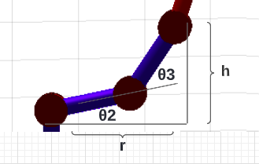

# Lab 3: Inverse Kinematics with Phantom X 

This repository contains MATLAB and Python scripts to develop a model of inverse kinematics for the robot Phantom X. This requieres the definition of the robot's workspace and the implementation of a function to calculate the inverse kinematics given an specific position and orientation for the end effector. To check the proper operation of the inverse kinematics, an application of pick and place and motion in the robot's workspace was carried out.

## Authors

* Maria Alejandra Arias Frontanilla
* Camilo Andres Vera Ruiz

## Inverse Kinematics of Phantom X

In previous labs, we have already seen how with a certain configuration _q_, which gives us the corresponding values of the joints, we obtain a certain position and orientation of the end effector. That is what we call forward kinematics. That was pretty good and interesting but now it gets even better and more sophisticated because we are going to do the inverse process. Instead of choosing the values of the joints, we will now choose a certain position and orientation for the end effector and then we will figure out which values of joints, i.e. which configuration, we must have to achieve it. 

As you can imagine, this process is a little bit more complicated than the one of forward kinematics, but don't worry, we will understand it step by step.

### First Joint (The easiest one)

Ok! First things first. Let's begin with the first joint. In order to calculate the value of each one of the joints, it's important to know the kind of information that we already have. In our case, we know the position and orientation of the end effector which can be given in a MTH of the tool like the following one:

  

Having the position in terms of _xc, yc_ and _zc_, it's easy to find the value for the first joint. 

  

As we can see in the image above, the value of θ1 for the first joint can be calculated as follows:

θ1 = atan2(yc, xc)

Great! We already have the first joint calculated. Let's go for the other 3.

### Kinematic Decoupling

For us to calculate the second and third joint, we will use something called kinematic decoupling in the wrist of our Phantom X. Wait a moment... Does the Phantom have a wrist? Yes! It does. And it has an elbow too. 

The wrist is located in the fourth joint and we will have to specify which position corresponds to it. 

With the MTH of the tool we have access to the values of the vector _|a|_ which in the previous image corresponds to the axis z on the tool tip. Our wrist is located close to the end point (_xc, yc, zc_) but with a negative displacement of value _L4_ (which corresponds to the length of the fourth link)in the same direction as the vector |a|. And that's exactly the way we will calculate it.

  

The position of W, Phantom X's wrist, is then calculated as follows:

  

At this point you may be wondering why we calculated _W_. Well, as everything in life, this also has a purpose and it's to allow us to find the values of the second and third joint seeing it as a 2R mechanism.

### Finding Second and Third Joint seeing it as a 2R

Don't you see it yet? No problem. The image below will help you to identify with ease what we mean with a 2R mechanism

  

If we take just the second and third joint with the end effector as the wrist, we have now a much simpler problem which can be solved using trigonometry. 

With the triangle that is formed and using the cosine law and getting help of our old dear friend Pythagoras, we get to the following values for θ2 and θ3, corresponding to the second and third joint, respectively. 

  

The values for θ2 and θ3 are shown below.

  

  

### Fourth Joint (we are almost done)

Now we are only missing the fourth joint, the last one. In this case we will use again our vector _|a|_. We will call φ the angle between _|a|_ and the plain formed by axes _x_ and _y_. If we see it closely, we can see that φ is equal to the sum of the angles θ2, θ3 and θ4. In this way we can find θ4 as follows:

θ4 = φ - θ2 - θ3 

Now, we just have to figure out how to measure that φ. 

Since we have all the components of our vector _|a|_, we can calculate φ using again Pythagoras. 

And we are finally done :D

This whole process of inverse kinematics is implemented in MATLAB in the file _invKinPhantom.m_ and in Python _getInvKin.py_. 

__Note__: The values of θ2 and θ4 are not directly the values that correspond to _q2_ and _q4_ since in the DH Parameters exists an offset that we have to take into account.


## Workspace of Phantom X and...
Esboce el espacio de trabajo del robot Phantom X.
Consulte los métodos disponibles en el toolbox para determinar la cinemática inversa de un manipulador.
Análisis:
Sabiendo que el robot Phantom X posee 4 GDL, de los cuales 3 corresponden a posición, el GDL restante
proporciona una medida independiente para un ángulo de orientación (asuma orientación en ángulos fijos).
¿De qué ángulo de orientación se trata?
¿Cuántas soluciones posibles existen para la cinemática inversa del manipulador Phantom X ?
Consulte en qué consiste el espacio diestro de un manipulador.

## Pick and Place Application

## Motion in robot's workspace

The last application that we developed for this lab relates to the whole robot's workspace. Using keyboard inputs, we will control the position of the end effector. 

To create the movements that will allows us to control the PhantomX, the class _Movement_ was created in the file _invKin.py_.

```
def jointCommand(command, id_num, addr_name, value, time):
    
    """
    Make a request to a the "dynamixel_command" ros service to modify a  
    parameter such as position or torque of the motor specified by the "id_num" 
    parameter.
    """
    rospy.wait_for_service('dynamixel_workbench/dynamixel_command')
    try:        
        dynamixel_command = rospy.ServiceProxy('/dynamixel_workbench/dynamixel_command', DynamixelCommand)
        result = dynamixel_command(command,id_num,addr_name,value)
        rospy.sleep(time)
        return result.comm_result
    except rospy.ServiceException as exc:
        print(str(exc))
```


